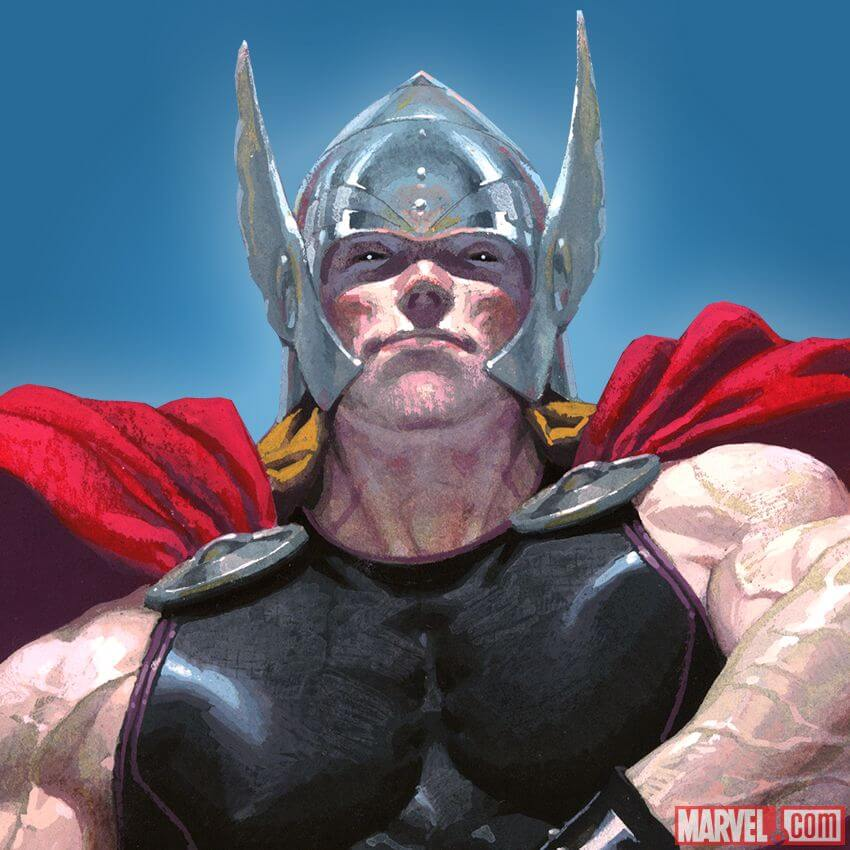

<!-- Projeto Finalizado -->
# ⚔️ Desafio DEV: Escolha Seu Personagem
<p align="center">
  <!-- Contador de linguagens do GitHub -->
  
  <!-- Tamanho do repositório no GitHub -->
  
  <!-- Licença do GitHub -->
  
</p>

<div align="center">
  
  
  
</div>

## ⚙️ Funcionalidades
- **Interatividade**: Passe o mouse sobre um personagem para alterá-lo.
- **Conteúdo Dinâmico**: A imagem e o nome do personagem principal mudam automaticamente.
- **Dois Jogadores**: Jogador 2 permanece fixo como Ultron.

## 🌐 Visualize o Projeto
Você pode visualizar o projeto online através deste [link](https://devandreotti.github.io/dev-hero-selector/).

## 🛠 Tecnologias
- **HTML5**: Estrutura da aplicação.
- **CSS3**: Estilos e animações.
- **JavaScript**: Lógica de manipulação da DOM.

## 🚀 Como Executar
1. **Clone o repositório**:
   ```bash
   git clone https://github.com/devAndreotti/dev-hero-selector.git
   ```
2. **Abra o `index.html` no navegador**.

## 💪 Contribuição
Contribuições são bem-vindas! Sinta-se à vontade para abrir issues ou fazer um fork do repositório e enviar pull requests.
1. Faça um fork do projeto.
2. Crie uma nova branch para sua feature `git checkout -b feature/nome-feature`.
3. Commit suas mudanças `git commit -m 'Adiciona nova feature'`.
4. Envie para a branch `git push origin feature/nome-feature`.
5. Abra um Pull Request.

## 📝 Nota
Este projeto é para fins educacionais, baseado no curso do **Dev em Dobro**. Sinta-se livre para explorar e adaptar.

<br>

---
<p align="center"> Desenvolvido por <a href="https://github.com/devAndreotti">Ricardo Andreotti Gonçalves</a> </p>

---
